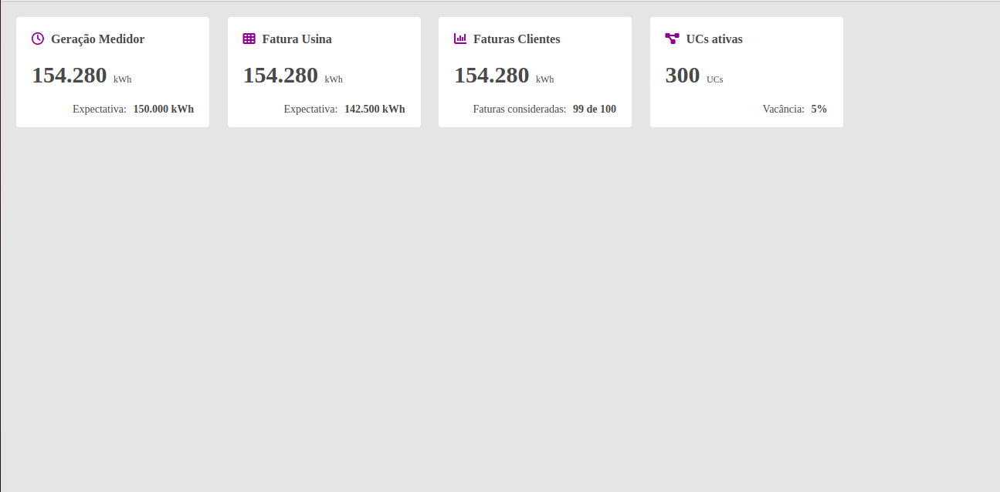

# Desafio de Front-end

## Propósito
Exercitar o desenvolvimento de layouts do dia a dia com html e css.

## Layout a ser desenvolvido
Este layout faz parte de uma das telas do Portal GD. Pode usar a imagem abaixo como referência, ou abrir o arquivo desafio.png

## Detalhes do layout
* Espaçamento da tela pros cards: 20px;
* Espaçamento entre cards: 20px;
* Cor de fundo da tela: #E5E5E5;
* Cor do texto: #4A4A4A;
* Tamanho da fonte: 14px;
* Detalhes do Card:
    * Largura: 250px
    * Icones: Estão sendo utilizados, respectivamente, os seguintes ícones:
        * fa-regular fa-clock
        * fa-solid fa-table-cells
        * fa-solid fa-chart-column
        * fa-solid fa-diagram-project
    * Espaçamento interior do card: 
        * Topo e laterais: 20px; 
        * Inferior: 15px;
    * Cabeçalho:
        * Tamanho da fonte: 16px;
        * Cor do icone: #82008F;
    * Corpo do card:
        * Espaçamento Superior e inferior: 20px;
        * Texto principal:
            * Tamanho da fonte: 30px;
            * Negrito;
        * Texto auxiliar:
            * Tamanho da fonte: 12px;
    * Rodapé do card:
        * Texto em destaque: Negrito.

# Informações Extras:
* [Site do font-awesome](https://fontawesome.com/icons/)